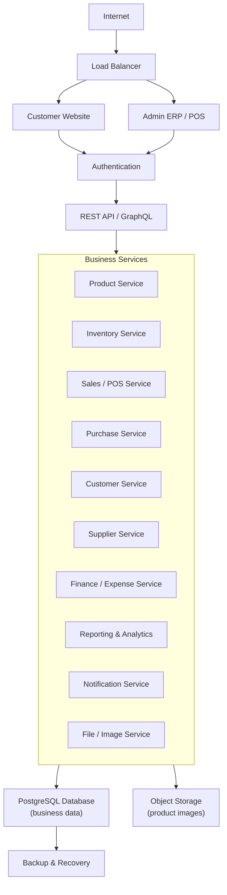

# Production System Architecture

## Subhakamana Store Management System

This architecture preserves the existing customer website and ERP interface while replacing browser-only storage with secure backend services.

---

## 1. Target Architecture

Production traffic should enter through the internet and load balancer, then route users to either the customer website or the internal Admin ERP/POS. Both frontends should use authentication before calling the backend API layer. The API layer then calls business services, which store business records in PostgreSQL and product images in object storage. Backup and recovery protects the database.

---

## 2. Frontend Layer

The existing frontend should be preserved first.

Frontend responsibilities:

- Display products
- Display cart and checkout
- Display ERP dashboard
- Display POS
- Display delivery by bill number
- Display reports
- Display business controls
- Call backend APIs
- Show validation errors
- Show success confirmations

Frontend should not:

- Trust prices from the browser
- Trust stock from the browser
- Finalize payments by itself
- Finalize inventory changes by itself
- Authorize users by front-end role only
- Store production business records only in browser storage

---

## 3. API Layer

The REST API is the main bridge between frontend and backend.

API responsibilities:

- Validate requests
- Authenticate users
- Enforce permissions
- Call business services
- Return safe responses
- Rate-limit sensitive actions
- Write audit logs

Recommended API groups:

- `/api/auth`
- `/api/users`
- `/api/products`
- `/api/inventory`
- `/api/purchases`
- `/api/pos`
- `/api/orders`
- `/api/payments`
- `/api/deliveries`
- `/api/returns`
- `/api/reports`
- `/api/notifications`
- `/api/settings`

---

## 4. Authentication Service

Authentication replaces demo PIN login.

Responsibilities:

- Secure login
- Password hashing
- Email verification
- Forgot password
- Password reset
- Session timeout
- Refresh token rotation
- Role-based access control
- Permission middleware

Recommended security:

- Argon2 or bcrypt password hashing
- Secure HTTP-only cookies or secure JWT refresh token design
- Short-lived access token
- Server-side permission checks
- Login rate limiting
- Audit logs for login and logout

---

## 5. Business Services

Business services should contain the real rules.

Services:

- Product service
- Inventory service
- Purchase service
- POS service
- Order service
- Payment service
- Delivery service
- Return/refund service
- Stocktake service
- Cashier shift service
- Report service
- Audit service

Example:

When POS completes a sale, the backend should:

1. Validate cashier permission.
2. Validate cart items.
3. Validate stock.
4. Apply discount rules.
5. Create order.
6. Create payment record.
7. Reduce stock through inventory ledger.
8. Create audit log.
9. Return receipt data.

---

## 6. Database Layer

PostgreSQL is recommended because the system needs relational accuracy.

Database responsibilities:

- Store products and variants
- Store inventory states
- Store stock ledger
- Store orders and order items
- Store payment records
- Store delivery records
- Store returns and refunds
- Store audit logs
- Store notifications
- Store user permissions

All critical stock and payment changes should use transactions.

---

## 7. Cloud Image Storage

Production image storage should replace browser-only image previews.

Recommended options:

- AWS S3
- Cloudinary
- Firebase Storage

Image service responsibilities:

- Validate file type
- Validate file size
- Compress image
- Store original and optimized versions
- Save image URL in database
- Prevent unsafe upload files

---

## 8. Payment Integration

Payment integrations should be verified server-side.

Supported methods:

- Cash
- Cash on Delivery
- eSewa
- Khalti
- Bank Transfer

Payment service responsibilities:

- Create payment intent or pending payment record
- Verify gateway response
- Handle webhooks
- Prevent duplicate payments
- Support refunds
- Reconcile bank transfer and COD

---

## 9. Courier Integration

Delivery should continue to use bill number and product-first tracking.

Delivery service responsibilities:

- Create shipment from bill number
- Store products to pack
- Store courier details
- Create tracking number
- Update shipment status
- Handle failed delivery
- Handle returned shipment
- Reconcile COD

---

## 10. Reporting Engine

Reports should be generated from backend transaction tables.

Reports:

- Sales report
- Inventory report
- Profit report
- Loss report
- Purchase report
- Supplier report
- Customer report
- Cash flow report
- Daily sales report
- Monthly sales report
- Top products report
- Dead stock report
- Stock aging report

---

## 11. Audit Service

Every critical action should create an audit log.

Examples:

- Login
- Logout
- Product edit
- Price change
- Inventory change
- Order edit
- Refund
- Delete
- Permission change
- Export

Audit records should not be editable by normal users.

---

## 12. Notification Service

Notifications can be added after core backend stability.

Notification channels:

- Email
- SMS
- WhatsApp
- In-app alerts

Notification types:

- Low stock alert
- Order confirmation
- Payment update
- Delivery update
- Return update
- Refund update

---

## 13. Production Deployment

Production deployment should include:

- Docker
- Environment variables
- HTTPS
- Domain
- CI/CD
- Database migrations
- Health checks
- Application logs
- Error monitoring
- Automatic backups

---

## 14. Architecture Principle

The frontend should remain familiar, but the backend must become the source of truth.
